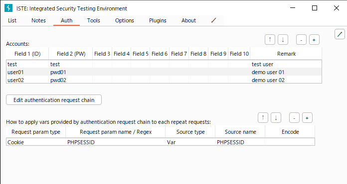
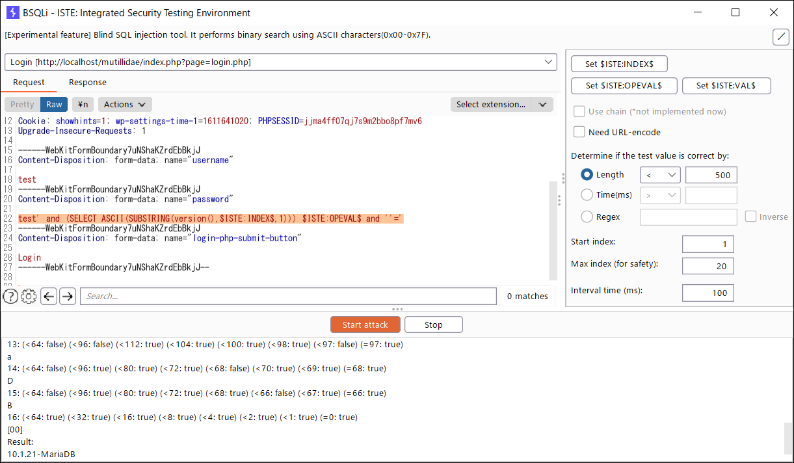

[English](README.md) / Japanese

# ISTE: Integrated Security Testing Environment

Webアプリケーションの脆弱性診断をトータルサポートする Burp extension（Burp Suiteの拡張機能）です。  
診断員を煩雑な作業から解放し、全集中へと導きます。

## Features

### Basic Features

| 機能　　　　　　　　　　 | 説明 | 備考 |
| :-- | :-- | :-- |
| URL一覧 | 診断対象となるURLをプロジェクト単位で一覧管理する機能。名称や備考の記入、並べ替えやフィルタリング、TSVやテンプレート形式でのクリップボードへのコピー、各種 Send To 機能等も提供。 | URLと生ログを紐づけてDB（SQLite）に保存するので、スプレッドシート等でURL一覧を作成した際に生じるURL一覧と生ログの目マッピングが不要に。 |
| 診断メモ | プロジェクト単位、URL単位、リピート単位のメモ機能。 | 生ログを横目にメモを書け、生ログに紐づけてDBに保存する。メモの保存はフォーカスアウトのタイミング。 |
| 進捗管理 | URL一覧において進捗記入列を提供。進捗に応じた自動色付け、フィルタリングが可能。 | URL一覧と進捗管理表のダブルメンテや書式維持に消耗する時間が不要に。フィルタリング操作も軽快。 |
| リピート履歴管理 | URL一覧の各URLについて、リピート実行機能とリピート履歴管理機能を提供。 | 純正 Repeater の不満解消。 |

### Advanced Features

| 機能　　　　　　　　　　 | 説明 | 備考 |
| :-- | :-- | :-- |
| リピートマスタ | URL一覧の各URLについて、リピート実行のためのベースリクエスト(Master)を定義し、リクエスト編集のベースとして呼び出し可能とする機能。 | 繰り返し試験値を変化させながらリピート実行する際に、ベースとしたいリクエストを適宜保存しておくと便利。 |
| **アカウント指定リピート** | 対象システムのアカウントを指定してリピート実行する機能。セッション再取得ボタンも提供。 | 認可制御の診断を強力サポート！ |
| アカウント管理 | 対象システムのアカウントを一覧管理する機能。 | 登録したアカウントはアカウント指定リピートで使用可能。 |
| 認証定義 | 対象システムの認証フロー、および認証フローの結果として得たセッションID等をリピートリクエストに反映する方法を定義する機能。この定義を使用して、アカウント指定リピートを実行する。 | 認証フローの実体はリクエストチェーン（後述）。 |

### Experimental Features

| 機能　　　　　　　　　　 | 説明 | 備考 |
| :-- | :-- | :-- |
| リクエストチェーン | URL一覧の各URLについて、リクエストチェーン（複数リクエストの連なりおよびパラメータ引継ぎを定義したもの）を定義し、リピート実行する機能。 | 現状は使い勝手が悪い（引継ぎ設定項目のプルダウン化、設定の半自動化、ステップ実行、等々やりたい改善多数）。 |
| 診断メモのエクスポート | 簡易なMarkdown形式で診断メモをエクスポートする機能。 | 色々考慮できていないが、診断メモを他者に共有したい場合に最低限使える程度の機能ではある。また、診断メモの検索機能が未実装なので、エクスポート＆テキストエディタで検索等の使い方も。 |
| プラグイン | ISTEの拡張機能を開発できる拡張ポイントを提供。 | ISTEの機能は基本的に本体に実装していくが、極めて個人的な機能(自作アプリとの連携機能など)は、プラグインとして外出し実装する。現状はかなり制約が厳しいのでサンプルプラグインは提供しないが、作者の実用には辛うじて耐えている。 |

#### Exploit Features

※本機能群は特に、対象システムの管理者の許可なく実行しないようご注意ください。不正アクセス禁止法等の法令違反に当たる可能性があります。

| 機能　　　　　　　　　　 | 説明 | 備考 |
| :-- | :-- | :-- |
| Blind SQL Injection | 検出済みの Blind SQL Injection 脆弱性を利用したデータ抽出作業を自動化する機能。脆弱性が利用可能であることの証明を目的として、データベースのバージョン情報等を抽出する際に用いる。 | 汎用性を優先した玄人向け機能。ASCIIコード(10進)を探索範囲とする二分探索を実施。 |

## Prerequisites

[Burp Suite Professional](https://portswigger.net/burp/pro) or [Burp Suite Community Edition](https://portswigger.net/burp/communitydownload)

## Installing ISTE

1. [Releases](https://github.com/okuken/integrated-security-testing-environment/releases) から Latest release の iste-x.x.x.jar ファイルをダウンロード
1. Burp Suite を起動し、Extender > Extensions にて Add ボタンを押下
1. 下記のとおり指定して Next ボタンを押下
   * Extension type: Java
   * Extension file (.jar): 上記でダウンロードした jar ファイルを選択

## Getting Started

### ISTE起動時
1. DBファイル(SQLite3(.db))のパスを指定 ※初回のみ
   * 変更方法：ISTE > Options > User options > Misc
1. ISTEプロジェクトを選択
   * 初回や新たに診断案件を開始する場合は、「** Create new project **」を選択してISTEプロジェクトを新規作成する
   * Burp Suite Professional を使用している場合は、ISTEプロジェクト名をBurpプロジェクト名と同じにしておくと、次回以降はISTEプロジェクトが自動選択されるのでお勧め
   * 変更方法：ISTE > List のプロジェクト名横にある「...」ボタン

### 基本の流れ
1. 診断案件の基本情報をメモ
   * ISTE > Notes に記入する（プロジェクト単位のメモ）
   * なお、プロジェクト単位のメモはテンプレを設定できる。ISTE > Options > User options > Note templates > Notes
1. 診断対象となるURL一覧の作成
   * Burp Suiteをプロキシに設定した状態で、診断対象システムを巡回する
   * Proxy > HTTP history において診断対象のURLを選択し、コンテキストメニューの Send to ISTE を実行することで、ISTE > List にURLを追加する
   * ISTE > List の Name 列には、デフォルトで Proxy > HTTP history の Comment の内容が入力されるので、必要に応じて編集する。Remark 列等にも必要に応じて備考を記入する
1. 診断作業を実施
   * ISTE > List において診断対象URLを選択し、画面右側のメモ欄にメモをとりながら診断作業を実施する
   * なお、URL単位のメモはテンプレを設定できる。ISTE > Options > User options > Note templates > List
   * 診断を終えたURLは、進捗(Progress)列の値を Done にする
   * 必要に応じて画面上方の進捗フィルタを使って残数を確認しつつ作業を進める

### 高度な使い方

#### リピート機能の使用
* ISTE > List においてリピート実行対象のURLを選択し、画面下方の Repeat タブにて、リクエストを適宜編集して Send ボタンで送信する
* リピート履歴テーブルが同タブの上方に表示されるので、適宜メモ列にメモをとりながら診断を進める
* リクエスト編集欄をオリジナルのリクエストに戻したい場合は Org ボタンを押下する
* オリジナルのリクエストとは別に診断のベースとしたいリクエストができた場合は、Save as master ボタンで保存しておく。保存したリクエストは Master ボタンで呼び出せる
* なお、Burp Suite 2020.11 で追加された INSPECTOR 機能には未対応（Burp Extender API に追加されたら対応したい）

#### アカウント指定リピートの使用
1. ISTE > Auth において以下の設定を行う
   * Accounts テーブルにアカウントを登録する
      * 基本的には Field 1 にユーザID、 Field 2 にパスワードを入力する
   * 認証フローを定義する
      1. Edit authentication request chain ボタンを押下し、リクエストチェーン画面を開く
      1. 認証フローに必要なリクエストを追加し、必要に応じてパラメータ引継ぎの設定を行う
      1. ユーザID、パスワードをパラメータとするリクエストでは、Request manipulation テーブルに設定を追加し、 Source type 列には Account table を、Source name にはフィールド番号(ユーザIDなら1、パスワードなら2など）をそれぞれ指定する
      1. 動作確認したい場合は Run ボタンを押下する。診断対象システムへのアクセスが発生するので注意すること
      1. 認証の結果として得たセッションID等の値は、Response memorization テーブルにて登録しておく
      1. フローを組み終えたら、Save ボタンで保存してから画面を閉じる
   * 認証結果をリピートリクエストに反映する方法を定義する
      * How to apply vars provided by authentication request chain to each repeat requests テーブルに反映先を登録する  
        例）Cookie「sessionid」をセッションIDとしてセッション管理しているシステムの場合：
         * Request param type: Cookie
         * Request param name: sessionid
         * Source var name: 認証フローにおいて Response memorization テーブルに登録した Var name
1. アカウントを指定してリピート実行を行う
   * ISTE > List においてリピート実行対象のURLを選択し、画面下方の Repeat タブを開き、アカウントプルダウンにてアカウントを選択して Send ボタンを押下する
   * セッションを取り直したい場合は、アカウントプルダウン横の更新ボタンを押下する
   * セッションを取り直した上でリピート実行したい場合は、Shiftキーを押しながら Send ボタン押下

## Notes

* 一人用です
  * 診断メモ共有目的でのdbファイル受け渡しは想定内ですが、１つのISTEプロジェクトへの複数ISTEからの同時アクセスには対応していません（データ不整合が発生し得ます）
* 作者の普段使い用として開発を始めた経緯もあり、やっつけ実装です
  * 特に非機能面が緩く、入力チェックやエラーメッセージほぼなし、テキトーな英語、ソースコードの可読性・保守性厳しめ、…
  * 大きなRequest/ResponseはISTEに送らないのが吉です（制御を入れていないので、メモリを食いつぶしたり、dbファイルの肥大化を招きます）
  * DBは定期的にバックアップをとることを推奨します（SQLiteなのでdbファイルのコピペでOK）
    * 特に、ISTEのバージョンアップにはDBマイグレーションが含まれる場合があるため、バージョンアップ前には必ずバックアップをとってください（DBマイグレーションはISTE起動時に走ります。一応確認ダイアログは出していますが）
  * 作者が普段使いする上で困らない程度の品質ではあります（優しく扱っている限りはきっと大丈夫です）
* 作者の直近の困りごと駆動で開発していきます
* **作者は本ソフトウェアに起因あるいは関連して生じた損害等について、一切の責任を負いません**

## License

[GPLv3](LICENSE)
